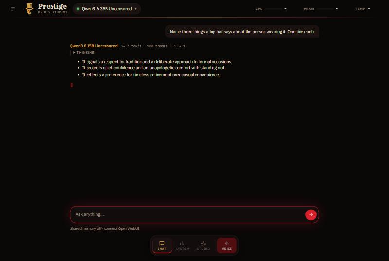
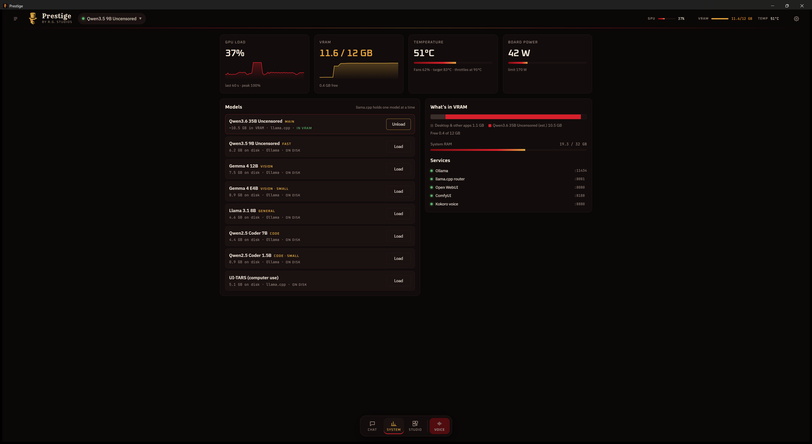
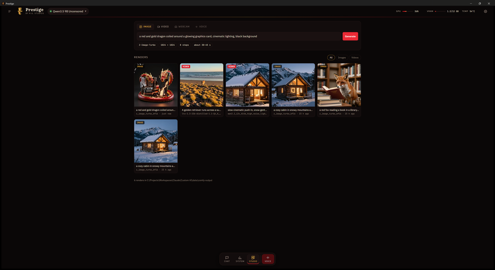
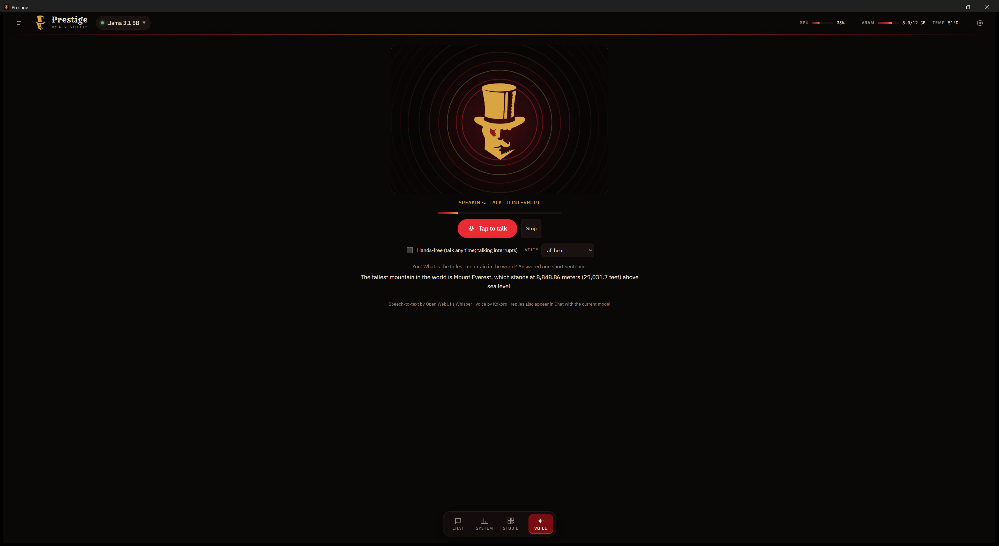

<p align="center">
  
</p>

<h1 align="center">Prestige by R.G. Studios</h1>

<p align="center"><i>Creating the world around you</i></p>

<p align="center">
  <a href="LICENSE"></a>
  
  
  
</p>

Prestige is a fully local AI desktop app for Windows 11. It chats, talks, sees through your webcam and makes images and
videos, and everything runs on your own PC. It's the front end for the
[Custom AI Workstation](https://github.com/Mr5elfDe5truct/custom-ai-workstation) stack (Ollama, llama.cpp, Open WebUI,
ComfyUI and Kokoro).

## Features

- **Chat** with streaming replies from Ollama and the llama.cpp router, a model switcher with roles (Main, Fast, Vision,
  General, Code), tokens per second on every reply, and chat history saved on your PC.
- **Shared memory**: reads and writes the same long-term memory as Open WebUI, so every model in both apps knows the same
  things about you. Say "remember that …" to add a fact.
- **System dashboard**: live GPU load, VRAM, temperature and power, every model with Load and Unload, what's in VRAM, system
  RAM and service status. It warns before a model won't fit.
- **Studio**: a gallery of your real ComfyUI renders (prompts read from the files), plus image generation (Z-Image-Turbo)
  and text-to-video with sound (LTX-2.3), with live progress.
- **Animate**: turn any image into a 5-second video with Wan 2.2.
- **Voice**: push-to-talk or hands-free conversation. Speech-to-text by Whisper, speech by Kokoro, spoken sentence by
  sentence as the reply streams. The top-hat avatar's eye and rings follow the voice.
- **Webcam vision**: a live preview, "Ask about this" with Gemma 4, and an optional live caption.
- **One click**: opening Prestige starts the stack if it isn't running, and closing it shuts the stack down.

## Screenshots

| Chat | System |
|---|---|
|  |  |
| **Studio** | **Voice** |
|  |  |

## Requirements

- The [Custom AI Workstation](https://github.com/Mr5elfDe5truct/custom-ai-workstation) stack installed, with its models.
  Prestige talks to it on `127.0.0.1` and runs its `start-all.ps1` and `stop-all.ps1`.
- An NVIDIA GPU. Built and tested on an RTX 3060 12 GB with 32 GB of RAM.
- Windows 11 (WebView2 is built in). Linux and macOS are the next goal.

## Install

Download `Prestige_<version>_x64-setup.exe` from the [Releases](https://github.com/Mr5elfDe5truct/prestige/releases)
page and run it. Prestige installs for your user only and adds a Start Menu shortcut.

### Build from source

You need [Node.js](https://nodejs.org) (LTS), [Rust](https://rustup.rs) (stable, MSVC) and
[Visual Studio 2022 Build Tools](https://visualstudio.microsoft.com/visual-cpp-build-tools/) with the
"Desktop development with C++" workload.

```powershell
git clone https://github.com/Mr5elfDe5truct/prestige
cd prestige
npm install
npm run tauri dev     # development window with hot reload
npm run tauri build   # installer in src-tauri\target\release\bundle\nsis\
```

## First run

Open **Settings** (the gear, top right):

1. **Custom AI folder**: where the workstation stack lives (the folder with `start-all.ps1`). The default is
   `C:\Projects\Workspaces\Claude\Custom AI`.
2. **Open WebUI API key** (for shared memory and speech-to-text):
   1. In Open WebUI (http://localhost:8080) open **Admin Panel → Settings → General** and turn on **Enable API Keys**.
   2. Open **Settings → Account → API keys → Create new secret key** and copy it.
   3. Paste it into Prestige, then click **Test** and **Save**.

   The key is stored only on your PC, in `%APPDATA%\com.rgstudios.prestige\settings.json`.
3. Optional: **Keep the AI services running when Prestige closes**.

Prestige asks Windows for the microphone and camera only when you use Voice or Webcam. If either is blocked, check
**Windows Settings → Privacy & security → Microphone / Camera**.

## How it's built

| Part | Where |
|---|---|
| UI (TypeScript, Vite) | `src/` · `main.ts` chat, `system.ts`, `studio.ts`, `voice.ts` + `speech.ts`, `camera.ts`, `memory.ts`, `backends.ts` |
| Native side (Rust, Tauri 2) | `src-tauri/src/` · GPU and RAM readouts, chat files, settings, start/stop scripts, gallery thumbnails, ComfyUI websocket and uploads |
| Fonts | Rye, Oxanium, IBM Plex Sans and JetBrains Mono, bundled from Fontsource (SIL Open Font License) |

## Credits

**Designed and built by Ryan B. Gyles** · R.G. Studios.

Built on [Tauri](https://tauri.app), and powered by [Ollama](https://ollama.com),
[llama.cpp](https://github.com/ggml-org/llama.cpp), [Open WebUI](https://github.com/open-webui/open-webui),
[ComfyUI](https://github.com/comfyanonymous/ComfyUI), [Kokoro-FastAPI](https://github.com/remsky/Kokoro-FastAPI) and
[faster-whisper](https://github.com/SYSTRAN/faster-whisper). Models by Qwen, Google (Gemma), Meta (Llama), Lightricks (LTX),
Wan-AI and Tongyi (Z-Image).

## License

[MIT](LICENSE) © 2026 Ryan B. Gyles. The models and apps it connects to keep their own licenses.
