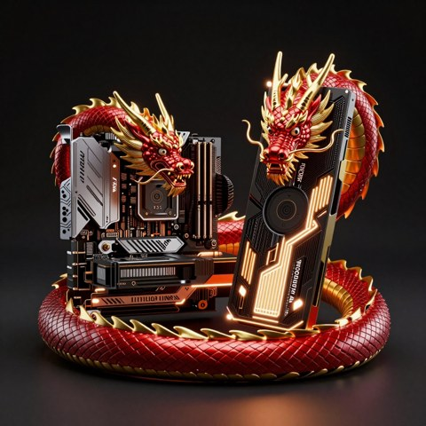
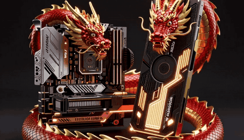
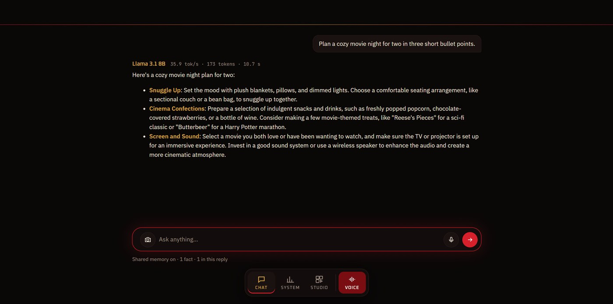
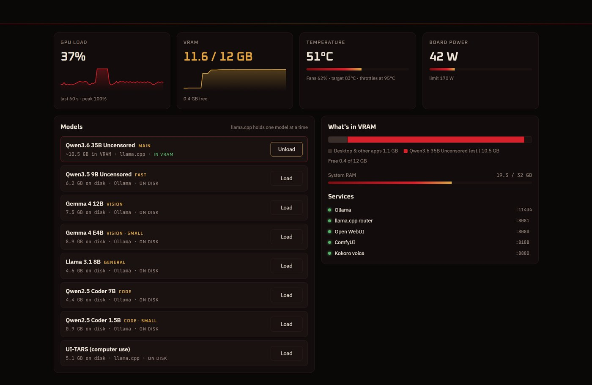
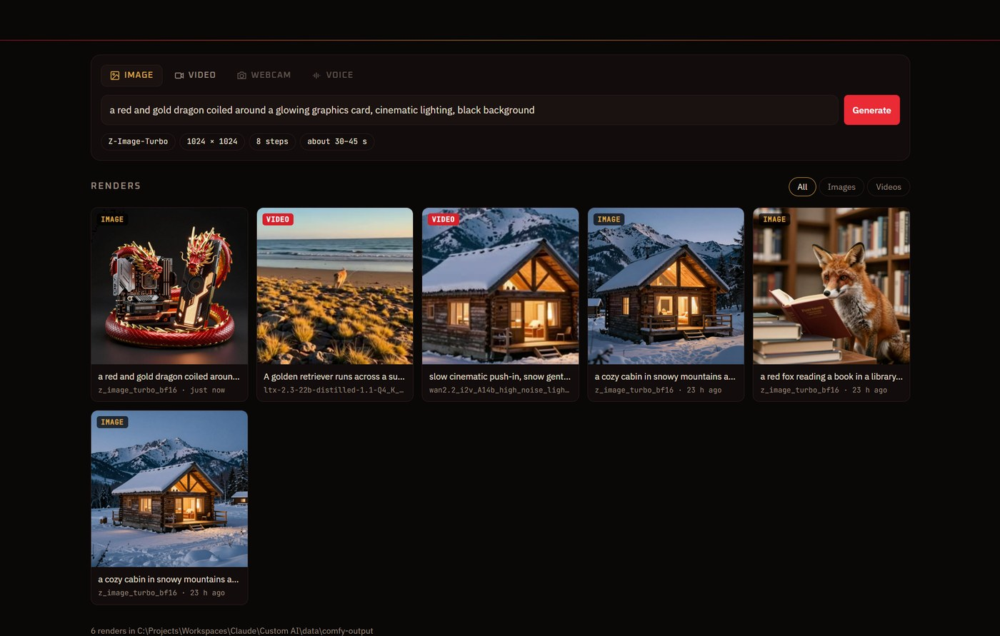
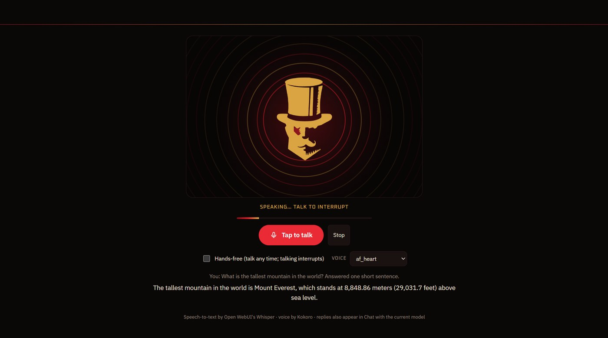

<p align="center">
  
</p>

<p align="center">
  <a href="https://github.com/Mr5elfDe5truct/prestige/releases/latest"></a>
  <a href="LICENSE"></a>
  
  
  <br>
  
  
  
  
  
  
  
  
  
</p>

<p align="center">
  <b>Your own AI, in a top hat.</b><br>
  A desktop app that chats, talks back, sees through your webcam and makes images and videos,<br>
  and runs entirely on your PC. No accounts, no cloud, no subscriptions.
</p>

---

## ✨ Made in Prestige

Everything below was made on the reference PC (RTX 3060 12 GB) from inside the app.

<table>
  <tr>
    <td align="center" width="50%">
      <br>
      <b>Studio → Image</b> · Z-Image-Turbo<br>
      <sub>"a red and gold dragon coiled around a glowing graphics card…" · 1024², about 45 s</sub>
    </td>
    <td align="center" width="50%">
      <br>
      <b>Studio → Animate</b> · Wan 2.2 image-to-video<br>
      <sub>the same image, brought to life · 5 s, about 11 min</sub>
    </td>
  </tr>
</table>

## 🎩 What it does

| | Feature | How |
|---|---|---|
| 💬 | **Chat with every local model** | Streaming from Ollama and the llama.cpp router, a model switcher with roles (Main · Fast · Vision · General · Code), tokens per second on every reply, history saved on your PC |
| 🔧 | **Tools in chat** | Web search, page fetching, the Reddit / Hugging Face / GitHub scout, files, PowerShell and browser control from the workstation's tool server, switched per group. Anything that changes something asks first |
| 🏷️ | **Know your models** | Every model shows what it can do (🔧 tools, 👁 vision, 🧠 thinking, 💻 code, 🔓 uncensored) and whether it fits in VRAM, detected automatically for anything you add |
| 🛒 | **Model catalog** | 27 models checked to run on a 12 GB card, with what each is good at. One click downloads into the workstation and it's ready to pick |
| 🧠 | **Shared long-term memory** | The same memory as Open WebUI, so every model in both apps knows you. Say *"remember that …"* |
| 📊 | **System dashboard** | Live GPU load, VRAM, temperature and power, Load/Unload for every model, a what's-in-VRAM bar, RAM and service status, and a warning before a model won't fit |
| 🖼️ | **Studio** | A gallery of your real ComfyUI renders, with prompts read from the files, plus image generation and text-to-video with sound, with live progress |
| 🎬 | **Animate** | Turn any image into a 5-second video with Wan 2.2 |
| 🎙️ | **Voice conversation** | Push-to-talk or hands-free, with Whisper listening and Kokoro speaking each sentence as the reply streams. Talk over it to interrupt |
| 🎩 | **A living avatar** | The top-hat's red eye and gold rings pulse with its actual voice |
| 👀 | **Webcam vision** | *Ask about this* sends the frame to Gemma 4, live captions, and a camera button in chat |
| ⚡ | **One click** | Opening Prestige starts the AI stack; closing it shuts everything down and frees the GPU |

## 📸 Screenshots

<table>
  <tr>
    <td width="50%"><br><p align="center"><b>Chat</b></p></td>
    <td width="50%"><br><p align="center"><b>System</b></p></td>
  </tr>
  <tr>
    <td><br><p align="center"><b>Studio</b></p></td>
    <td><br><p align="center"><b>Voice</b></p></td>
  </tr>
</table>

## 🖥️ Requirements

- **The [Custom AI Workstation](https://github.com/Mr5elfDe5truct/custom-ai-workstation) stack**, installed with its models.
  Prestige is its front end: it talks to Ollama, llama.cpp, Open WebUI, ComfyUI and Kokoro on `127.0.0.1`, and runs the
  stack's `start-all.ps1` and `stop-all.ps1`.
- **An NVIDIA GPU.** Built and tested on an RTX 3060 12 GB with 32 GB of RAM.
- **Windows 11** (WebView2 is built in). Linux and macOS are the next goal.

## 🚀 Install

Grab **`Prestige_<version>_x64-setup.exe`** from the [Releases](https://github.com/Mr5elfDe5truct/prestige/releases/latest)
page and run it. It installs to `C:\Program Files\RG Studios\Prestige` (Windows asks for admin approval once) and adds
Prestige to the Start Menu and the desktop.

### 🛠️ Build from source

You need [Node.js](https://nodejs.org) LTS, [Rust](https://rustup.rs) (stable, MSVC) and
[Visual Studio 2022 Build Tools](https://visualstudio.microsoft.com/visual-cpp-build-tools/) with **Desktop development with C++**.

```powershell
git clone https://github.com/Mr5elfDe5truct/prestige
cd prestige
npm install
npm run tauri dev     # development window with hot reload
npm run tauri build   # installer in src-tauri\target\release\bundle\nsis\
```

## ⚙️ First run

On first launch Prestige asks **what to call you** (and, optionally, a few things about you every model should know). It uses them
in the greeting and tells every model who it's talking to. Change them any time in **Settings**.

Open **Settings** (the gear, top right):

1. **Workstation folder**: where the Custom AI Workstation stack lives (the folder with `start-all.ps1`). The default is
   `%USERPROFILE%\RG Studios\Workstation` (for example `C:\Users\you\RG Studios\Workstation`).
2. **Open WebUI API key**, for shared memory and speech-to-text:
   1. In Open WebUI (http://localhost:8080) open **Admin Panel → Settings → General** and turn on **Enable API Keys**.
   2. Open **Settings → Account → API keys → Create new secret key** and copy it.
   3. Paste it into Prestige, then click **Test** and **Save**. It's stored only on your PC, in `%APPDATA%\com.rgstudios.prestige`.
3. Optional: **Keep the AI services running when Prestige closes**.

Mic or camera blocked? Check **Windows Settings → Privacy & security → Microphone / Camera → let desktop apps access**.

## 🏗️ How it's built

| Part | What |
|---|---|
| `src/` (TypeScript + Vite) | `main.ts` chat · `system.ts` dashboard · `studio.ts` gallery and generation · `voice.ts` + `speech.ts` voice · `camera.ts` webcam · `memory.ts` shared memory · `backends.ts` Ollama / llama.cpp |
| `src-tauri/` (Rust + Tauri 2) | GPU and RAM readouts, chat files and settings, start/stop scripts, gallery thumbnails, ComfyUI websocket and uploads, mic and camera permissions |
| Look | Dragon red & gold · fonts Rye, Oxanium, IBM Plex Sans and JetBrains Mono, bundled from Fontsource (SIL OFL) |

## 🔗 Part of the Custom AI Workstation

Prestige is the desktop app for **[Custom AI Workstation](https://github.com/Mr5elfDe5truct/custom-ai-workstation)**:
one folder, one script, one 12 GB GPU. The workstation holds the services, models and tools; Prestige is the way to use them.

## 🙏 Credits

**Designed and built by Ryan B. Gyles · R.G. Studios.**

Built on [Tauri](https://tauri.app), and powered by [Ollama](https://ollama.com), [llama.cpp](https://github.com/ggml-org/llama.cpp),
[Open WebUI](https://github.com/open-webui/open-webui), [ComfyUI](https://github.com/comfyanonymous/ComfyUI),
[Kokoro-FastAPI](https://github.com/remsky/Kokoro-FastAPI) and [faster-whisper](https://github.com/SYSTRAN/faster-whisper).
Models by Qwen, Google (Gemma), Meta (Llama), Lightricks (LTX), Wan-AI and Tongyi (Z-Image).

## 📜 License

[MIT](LICENSE) © 2026 Ryan B. Gyles. The apps and models it connects to keep their own licenses.
